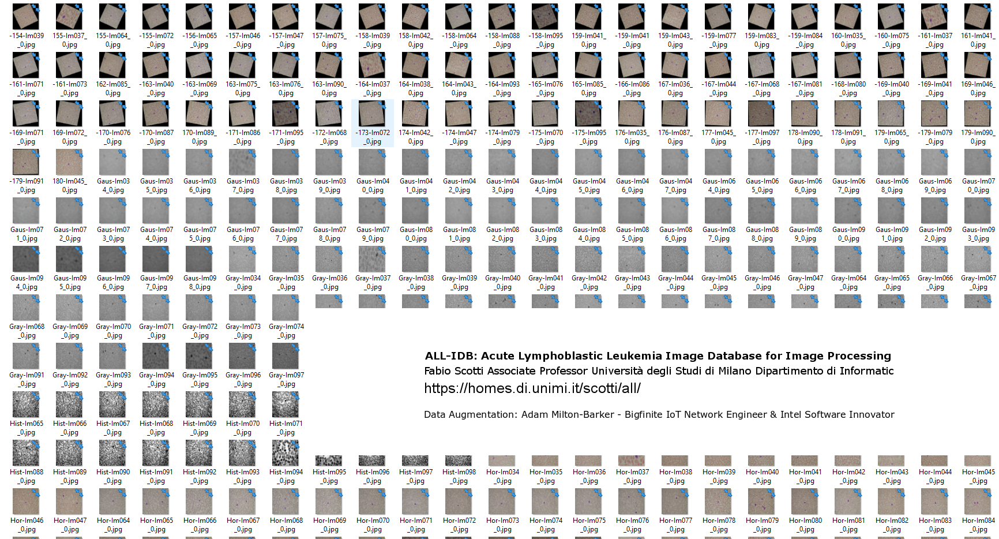

# Acute Myeloid/Lymphoblastic Leukemia Classifier Data Augmentation
 

The AML/ALL Classifier Data Augmentation program applies filters to datasets and increases the amount of training / test data available to use. The program is part of the computer vision research and development for the Peter Moss Acute Myeloid/Lymphoblastic (AML/ALL) Leukemia AI Research Project. This page will provide general information, as well as a guide for installing and setting up the augmentation script.

The classifier can currently be run by using a local configuration file, but you will soon be able to manage the configurations using the GeniSys UI also.

| Project  | Description | Author | 
| ------------- | ------------- | ------------- |
| [Data Augmentation Using Python](https://github.com/AMLResearchProject/AML-Detection-System/tree/master/Augmentation/Augmentation.ipynb "Data Augmentation Using Python") | A Python tutorial and Jupyter Notebook for applying filters to datasets to increase the amount of training / test data. | [Adam Milton-Barker](https://github.com/AdamMiltonBarker "Adam Milton-Barker") |

# Research papers followed
Research papers used in this part of the project were shared by project team member, [Ho Leung Ng](https://github.com/holeung "Ho  Leung Ng"), Associate Professor of Biochemistry & Molecular Biophysics at Kansas State University.

| Paper  | Description | Link | 
| ------------- | ------------- | ------------- |
| Leukemia Blood Cell Image Classification Using Convolutional Neural Network | T. T. P. Thanh, Caleb Vununu, Sukhrob Atoev, Suk-Hwan Lee, and Ki-Ryong Kwon | [Paper](http://www.ijcte.org/vol10/1198-H0012.pdf "Paper") |

# Datasets
The [Acute Lymphoblastic Leukemia Image Database for Image Processing](https://homes.di.unimi.it/scotti/all/) dataset is used for this project. The dataset was created by [Fabio Scotti, Associate Professor Dipartimento di Informatica, Università degli Studi di Milano](https://homes.di.unimi.it/scotti/). Big thanks to Fabio for his research and time put in to creating the dataset and documentation, it is one of his personal projects. You will need to follow the steps outlined [here](https://homes.di.unimi.it/scotti/all/#download) to gain access to the dataset.

| Dataset  | Description | Link | 
| ------------- | ------------- | ------------- |
| Acute Lymphoblastic Leukemia Image Database for Image Processing | Created by [Fabio Scotti, Associate Professor Dipartimento di Informatica, Università degli Studi di Milano](https://homes.di.unimi.it/scotti/).  | [Dataset](https://homes.di.unimi.it/scotti/all/#download "Dataset") |

# System Requirements

- Tested Ubuntu 18.04 & 16.04
- Tested in Python 3.5
- Requires PIP3
- Jupyter Notebook

# Installation
Below is a guide on how to install the augmentation program on your device, as mentioned above the program has been tested with Ubuntu 18.04 & 16.04, but may work on other versions of Linux and possibly Windows.

## Clone the repository
First of all you should clone the [AML/ALL Detection System](https://github.com/AMLResearchProject/AML-Detection-System/ "AML/ALL Detection System") repo to your device. To do this can you navigate to the location you want to download to on your device using terminal  (cd Your/Download/Location), and then use the following commands:

```
  $ git clone https://github.com/AMLResearchProject/AML-Detection-System.git
```

Once you have used the command above you will see a directory called __AML-Detection-System__ in the location you chose to download the repo to. In terminal, navigate to the __AML-Detection-System/Augmentation__, you are now ready to move onto starting your Jupyter Notebook server.

## Jupyter Notebook
You need to make sure you have Jupyter Notebook installed, you can use the following commands to install Jupyter, if you are unsure if you have it installed you can run the commands and it will tell you if you already have it installed and exit the download. 

```
  $ pip3 install --upgrade pip
  $ pip3 install jupyter
```
Once you have completed the above, make sure you are in the __AML-Detection-System/Augmentation__ directory and use the following commands to start your server, a URL will be shown in your terminal which will point to your Juupyter Notebook server with the required authentication details in the URL paramaters.

Below you would replace __###.###.#.##__ with local IP address of your device.

```
  $ jupyter --ip ###.###.#.##
```

# Contributing
We welcome contributions of the project. Please read [CONTRIBUTING.md](https://github.com/AMLResearchProject/AML-Detection-System/blob/master/CONTRIBUTING.md "CONTRIBUTING.md") for details on our code of conduct, and the process for submitting pull requests.

# Versioning
We use SemVer for versioning. For the versions available, see [Releases](https://github.com/AMLResearchProject/AML-Detection-System/releases "Releases").

# License
This project is licensed under the **MIT License** - see the [LICENSE](https://github.com/AMLResearchProject/AML-Detection-System/blob/master/LICENSE "LICENSE") file for details.

# Bugs/Issues
We use the [repo issues](https://github.com/AMLResearchProject/AML-Detection-System/issues "repo issues") to track bugs and general requests related to using this project. 

# Repository Manager
Adam is a [BigFinite](https://www.bigfinite.com "BigFinite") IoT Network Engineer, part of the team that works on the core IoT software. In his spare time he is an [Intel Software Innovator](https://software.intel.com/en-us/intel-software-innovators/overview "Intel Software Innovator") in the fields of Internet of Things, Artificial Intelligence and Virtual Reality.

[](https://github.com/AdamMiltonBarker)