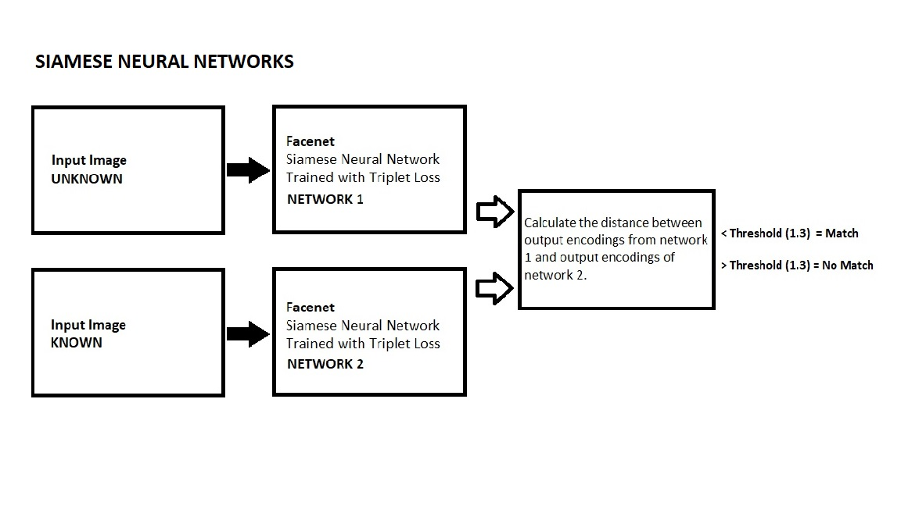

# Acute Myeloid/Lymphoblastic Leukemia Detection System Vision Server
 

# Introduction
The **Acute Myeloid/Lymphoblastic Leukemia Detection System Vision Server** hosts a local REST API server that allows applications to manage data and classify images via REST requests. 

# Open Set Recognition Issue
 
Credit: [Walter J. Scheirer](https://www.wjscheirer.com/projects/openset-recognition/ "Walter J. Scheirer")

The Open Set Recognition Issue is a common, and unsolved issue with real world computer vision systems. The Open Set Recognition issue is especially common in facial recognition. Say you have a Convolutional Neural Network trained using Transfer Learning and Inception V3, you have trained the network to be able to detect Person 1 and Person 2 and your network is accurately classifying between Person 1 and Person 2. Now you introduce Person 3 to the network, more than likely your network uses Softmax as the final layer, this means your network is going to give the probability that Person 3 is Person 1, and the probability that Person 3 is Person 2, the highest probability will be the classification. Due to this issue your network will most likely classify Person 3 (an unknown person) as either Person 1 or Person 2 depending on the highest probability predicted.

One way to try and combat this issue is to have a 3rd class for "**unknown**" people. Previously I came across the Open Set Recognition Issue with my earlier version of **TASS** which was a **Tensorflow** model trained using Transfer Learning and Inception V3. The method of having a unknown class with random faces seemed to have no benefit with the Tensorflow version, but with a framework called **OpenFace** it was a good solution which worked well in small environments.

For the Tensorflow Transfer Learning version we could Siamese Neural Networks as a second oppinion to help reduce the problem of the Open Set Recognition Issue, but for this tutorial we are not using Transfer Learning. 

# Facial Recognition Server
The primary vision system is the Facial Recognition Server. API endpoints provide access to a **Facenet** classifier and the dataset. Facenet uses **Siamese Neural Networks** trained with **Triplet Loss**, Siamese Networks and Triplet Loss are used in this project due to their ability to help overcome the **Open Set Recognition Issue** in **facial recogniton**. 

The project runs on an **UP Squared** IoT development board and uses an **Intel® Movidius™ Neural Compute Stick** showing how computer vision can be run on gateway devices on **the edge** using smaller, lower spec IoT devices such as UP Squared or Raspberry Pi.

## Siamese Neural Networks
 

Siamese Neural Networks are made up of 2 **Convolutional Neural Networks** that are exactly identical, hence the name Siamese Neural Networks. Siamese Neural Networks can be used to differentiate between objects, or in this case, faces. Facenet uses Siamese Neural Networks that have been trained with Triplet Loss. 

Given an unseen example and a known example / multiple known examples we can pass the unseen example through the first Siamese Neural Network, and then compare the output encodings with output encodings from the single or multiple examples by calculating the difference between them. Using this method we are able to determine if the example passed to the first network is the same as one of the known examples, verifying if the person is known or not.

## Triplet Loss
Triplet Loss was used when training Facenet and reduces the difference between an anchor (an image) and a positive sample from the same class, and increases the difference between the ancher and a negative sample from an opposite class. Basically this means that 2 images with the same class (in this case, the same person) will have a smaller distance than two images from different classes (or 2 different people).

# Intel® Movidius™ Neural Compute Stick
 
The Intel® Movidius™ Neural Compute Stick is a piece of hardware, specifically a USB device, used for enhancing the inference process of computer vision models on low-powered/edge devices. The Intel® Movidius™ product is a USB appliance that can be plugged into devices such as Raspberry Pi and UP Squared, and basically takes the processing power off the device and onto the Intel Movidius brand chip, making the classification process a lot faster.

# Contributing
We welcome contributions of the project. Please read [CONTRIBUTING.md](https://github.com/AMLResearchProject/AML-Detection-System/blob/master/CONTRIBUTING.md "CONTRIBUTING.md") for details on our code of conduct, and the process for submitting pull requests.

# Versioning
We use SemVer for versioning. For the versions available, see [Releases](https://github.com/AMLResearchProject/AML-Detection-System/releases "Releases").

# License
This project is licensed under the **MIT License** - see the [LICENSE](https://github.com/AMLResearchProject/AML-Detection-System/blob/master/LICENSE "LICENSE") file for details.

# Bugs/Issues
We use the [repo issues](https://github.com/AMLResearchProject/issues "repo issues") to track bugs and general requests related to using this project. 

# About The Author
Adam is a [BigFinite](https://www.bigfinite.com "BigFinite") IoT Network Engineer, part of the team that works on the core IoT software. In his spare time he is an [Intel Software Innovator](https://software.intel.com/en-us/intel-software-innovators/overview "Intel Software Innovator") in the fields of Internet of Things, Artificial Intelligence and Virtual Reality.

